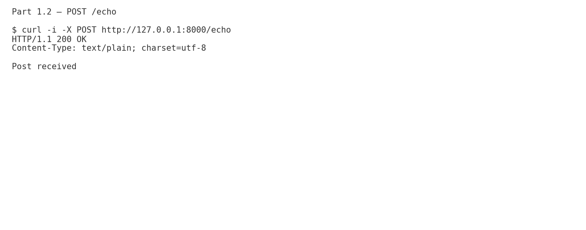
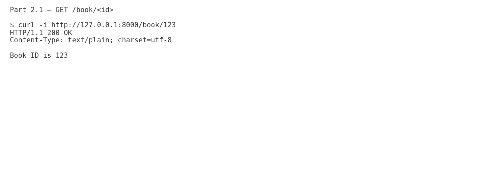
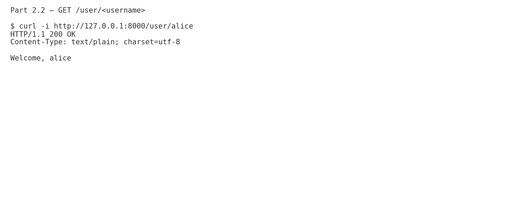
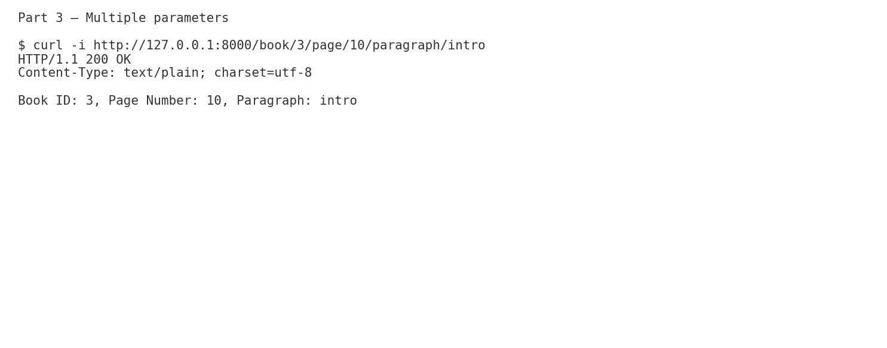
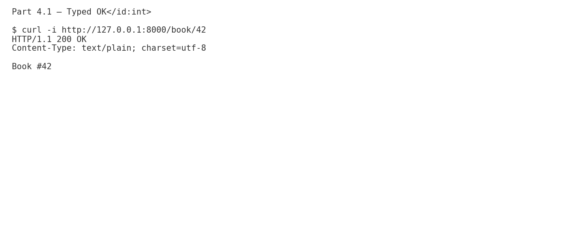
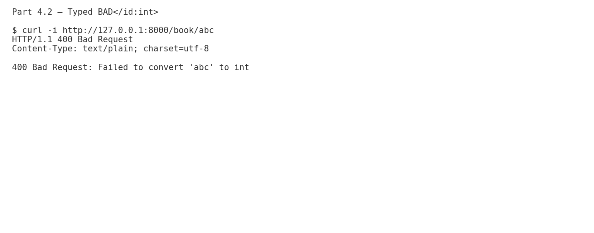

# Assignment – Custom WSGI Router with Decorators

**Student:** Mykhailo Naumenko  
**Project:** WSGI Router
**Repository:** **[https://github.com/mikhail2574/sdt-208-3-wsgi-router](https://github.com/mikhail2574/sdt-208-3-wsgi-router)**

---

## Environment & Style

- Python 3.9+
- Run server with **gunicorn** or **waitress** (commands below).
- Code is PEP8-compliant. Use:
  ```bash
  black .
  flake8 .
  ```

---

## Part 1. Basic Router with Decorators (15 pts)

- Implemented class `Router` (WSGI: `__call__`).
- Decorators: `@app.get(path)`, `@app.post(path)`.
- Registered routes stored with method, path, handler.
- Demo routes:
  - `GET /hello` → `"Hello, world!"`
  - `POST /echo` → `"Post received"`

**Run:**

```bash
gunicorn "router_task1:app" --bind 127.0.0.1:8000 --workers 1
# or
waitress-serve --listen=127.0.0.1:8000 router_task1:app
```

**Part 1. Screenshots:**  
  


---

## Part 2. Path Parameters (15 pts)

- Dynamic segments with `<param>` syntax.
- Extracted parameters passed as handler args.

**Demo:**

- `GET /book/<id>` → `"Book ID is 123"` for `/book/123`
- `GET /user/<username>` → `"Welcome, alice"` for `/user/alice`

**Run:**

```bash
gunicorn "router_task2:app" --bind 127.0.0.1:8000 --workers 1
```

**Part 2. Screenshots:**  
  


---

## Part 3. Multiple Path Parameters (15 pts)

- Supports any number of params anywhere in the path.
- Example: `/book/<id>/page/<number>/paragraph/<section>`

**Demo:** returns  
`Book ID: 3, Page Number: 10, Paragraph: intro`

**Run:**

```bash
gunicorn "router_task3:app" --bind 127.0.0.1:8000 --workers 1
```

**Part 3. Screenshots:**  


---

## Part 4. [Optional] Type Validation (+5 pts)

- Types via `<name:type>` e.g., `<id:int>` or `<slug:str>`.
- Supported: `str`, `int` (easily extensible).
- If conversion fails: returns **400 Bad Request**.

**Demo:**

- `GET /book/<id:int>` → `"Book #42"` for `/book/42`
- `GET /book/abc` → **400 Bad Request**

**Run:**

```bash
gunicorn "router_task4_bonus:app" --bind 127.0.0.1:8000 --workers 1
```

**Part 4. Screenshots:**  
  


---

## File Map

```
sdt-208-3-WSGI-router/
├─ pyproject.toml
├─ README.md
├─ router_core.py
├─ router_task1.py
├─ router_task2.py
├─ router_task3.py
├─ router_task4_bonus.py
└─ screens/
   ├─ part1_get_hello.png
   ├─ part1_post_echo.png
   ├─ part2_book_id.png
   ├─ part2_user_username.png
   ├─ part3_multiple_params.png
   ├─ part4_types_ok.png
   └─ part4_types_bad.png
```

---

## Notes

- The WSGI app object is named **`app`** in each task file, so `gunicorn "<module>:app"` works.
- You may extend `Router.SUPPORTED_TYPES` to add more types.
- All handlers return **plain text**.

---

## Repository Link

**[https://github.com/mikhail2574/sdt-208-3-wsgi-router](https://github.com/mikhail2574/sdt-208-3-wsgi-router)**
